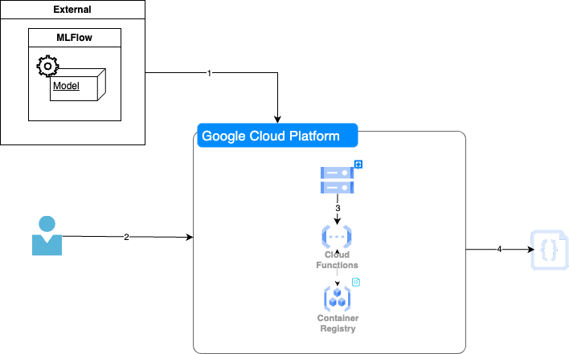

# Google Cloud Platform (GCP) Cloud Run Function Model Inference

[](https://github.com/kwame-mintah/gcp-cloud-run-function-model-inference/actions/workflows/run-version-bump.yml)
[](https://github.com/kwame-mintah/gcp-cloud-run-function-model-inference/actions/workflows/gcp-docker-build-and-push.yml)
[](https://github.com/kwame-mintah/gcp-cloud-run-function-model-inference/actions/workflows/gcp-cloud-run-deploy.yml)

A cloud function to invoke a prediction against a machine learning model that has been trained outside
a cloud provider, using tools like [MLFlow](https://mlflow.org/). This repository will not contain the model artifact output,
but the code for the cloud function.

FastAPI will be used for the cloud function as it offers many features e.g. authentication, body validation etc.
and overall easy to use and maintain. Note all GCP resources are created within this repository, some resources are created
via Terraform in this repository [terraform-gcp-model-serving](https://github.com/kwame-mintah/terraform-gcp-model-serving).

# Architecture



1. Machine learning model is trained outside GCP and model artifact output created,
2. User makes a request to a HTTP endpoint for a prediction,
3. Model artifact is stored within a bucket, when function is invoked -- model is downloaded,
4. Prediction is output via a HTTP response.

# Training using MLflow

As with all machine learning projects, your milage may vary (YMMV). This project will re-use existing data set for
[wine quality](https://archive.ics.uci.edu/dataset/186/wine+quality) using [mlflow-example](https://github.com/mlflow/mlflow-example)
for demonstration. The provided `docker-compose.yml` file will create the necessary resources needed to train locally.
The following steps below will start the services:

1. Start mlflow server, postgres and minio:

```shell
docker compose up -d --build
```

2. Access MLflow UI with http://localhost:5001
3. Access MinIO UI with http://localhost:9000*
4. Next start a training job within the `mlflow_server` container using the [cli](https://mlflow.org/docs/latest/cli.html#mlflow-run):

```shell
docker exec mlflow_server mlflow run https://github.com/mlflow/mlflow-example.git -P alpha=0.42
```

5. Once training has started, you should be able to view the run under 'Experiments' tab in MLflow UI
6. You can download the `model.pkl` using the UI under 'Artifacts' tab, but should be available locally under `/mlartifacts/`
7. Copy the model artifact `model.pkl` to the root directory of the project ready to be used locally in FastAPI

`*` Login with credentials used in `docker-compose.yml`.

> [!NOTE]
> Because the MLflow is a custom docker image, passing `--build` arg will cause the docker image to be re-built each time
> which is helpful when amending the `.mlflow/requirements.txt`. A re-build is not needed each time, if there is no changes
> being made to the file and `---build` can be omitted from the command.

## Running FastAPI

The following environment variables need to be set before attempting to run the application:

| Environment variable name             | Description                                                                 | Default | Required |
|---------------------------------------|-----------------------------------------------------------------------------|---------|----------|
| GCP_MLFLOW_MODEL_ARTIFACT_BUCKET_NAME | The GCP bucket name, where the model artifact has been uploaded             | N/A     | Yes      |
| USE_LOCAL_FILE_PATH_MODEL             | Use the model artifact found locally, rather than fetching from GCP bucket. | False   | No       |


1. Install python packages used for the service:

   ```shell
   pip install -r requirements.txt
   ```

2. Run the FastAPI server, which will start on port 8000:

   ```shell
   python main.py
   ```

   Endpoint documentation is available on: http://127.0.0.1:8000/docs

# Prediction with FastAPI

The application exposes  a single `/predict/*` endpoint, which allows the user to send a list of various quantitative
features needed to predict the wine quality. An example payload for predicting wine quality for one wine can be found below:

```json
[
  {
    "alcohol": 12.8,
    "chlorides": 0.029,
    "citric acid": 0.48,
    "density": 0.98,
    "fixed acidity": 6.2,
    "free sulfur dioxide": 29,
    "pH": 3.33,
    "residual sugar": 1.2,
    "sulphates": 0.39,
    "total sulfur dioxide": 75,
    "volatile acidity": 0.66
  }
]
```

Which will return an HTTP 200 Successful and a score e.g. `[3.6182495833379846]`.

## GitHub Action (CI/CD)

The GitHub Action "🚀 Push Docker image to GCP Artifact Registry" will check out the repository and push a docker image
to the chosen GCP Artifact Registry using [setup-gcloud](https://github.com/google-github-actions/setup-gcloud/tree/v2.1.2) action.
The following repository secrets need to be set:

| Secret                                    | Description                                                            |
|-------------------------------------------|------------------------------------------------------------------------|
| GCP_GITHUB_SERVICE_ACCOUNT_KEY            | The json private key for the GitHub service account                    |
| GCP_PREDICTION_SERVICE_ACCOUNT_KEY_BASE64 | The json private key base64 encoded for the prediction service account |

> [!IMPORTANT]
> The `GCP_PREDICTION_SERVICE_ACCOUNT_KEY_BASE64` must be base64 encoded this can be done with the following command e.g.
> `base64 -i <service_account>.json -o prediction_service_account.base64`. During the workflow run this will be decoded
> and used as part of the docker image build.

Additionally, the following variables need to be set:

| Secret                       | Description                           |
|------------------------------|---------------------------------------|
| GCP_PROJECT_ID               | The GCP Project ID                    |
| GCP_REGION                   | The region that project is in         |
| GCP_REGISTRY_REPOSITORY_NAME | The artifact registry repository name |

Lastly, GitHub Action "🛸 GCP Cloud Run Deploy" will check out the repository and deploy the cloud run function utilizing
the same GitHub action mentioned above. The following repository variable needs to be set:

| Secret                                | Description                                                     |
|---------------------------------------|-----------------------------------------------------------------|
| GCP_MLFLOW_MODEL_ARTIFACT_BUCKET_NAME | The GCP bucket name, where the model artifact has been uploaded |


# References

1. [How to serve deep learning models using TensorFlow 2.0 with Cloud Functions](https://cloud.google.com/blog/products/ai-machine-learning/how-to-serve-deep-learning-models-using-tensorflow-2-0-with-cloud-functions) by Rustem Feyzkhanov
